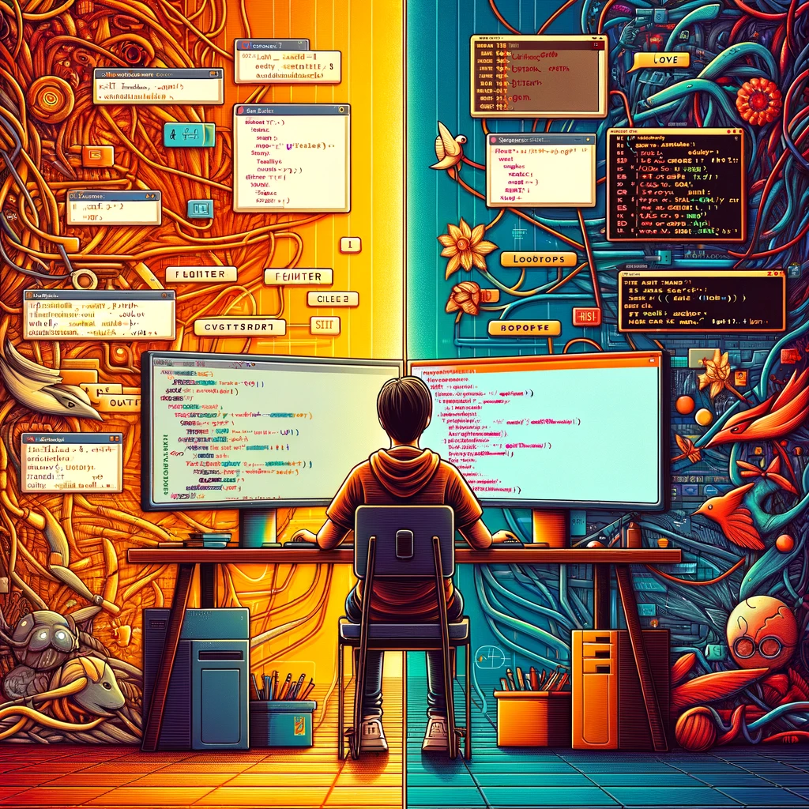
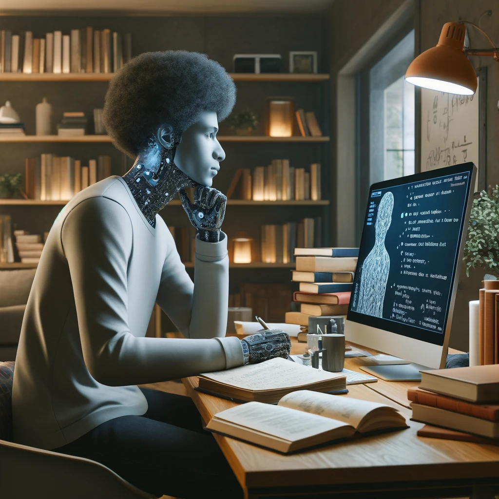
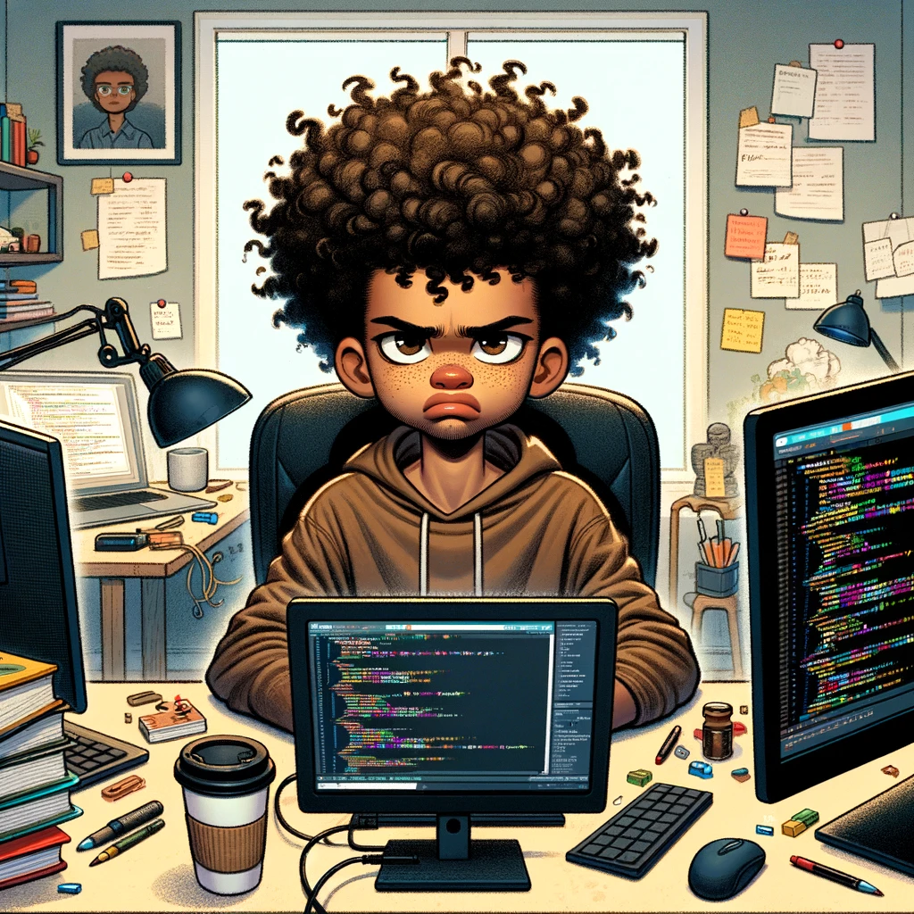
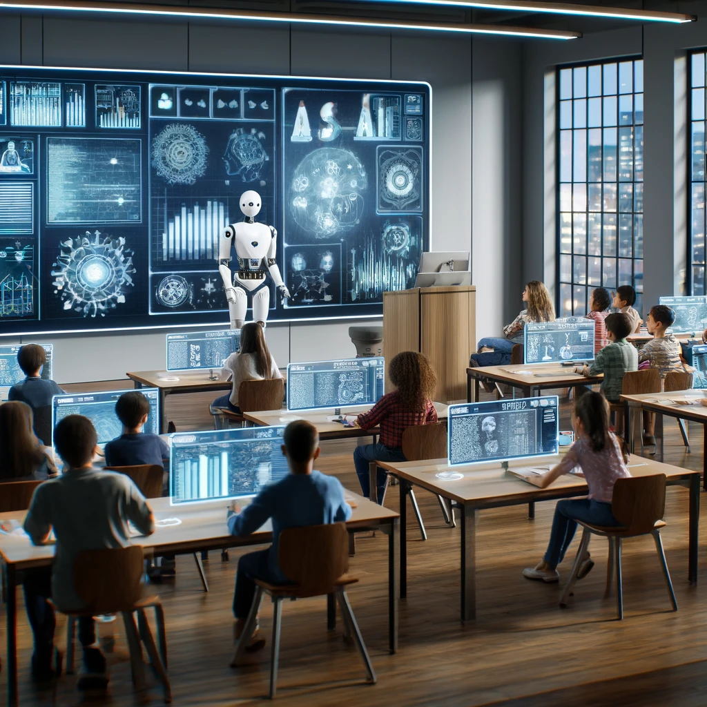
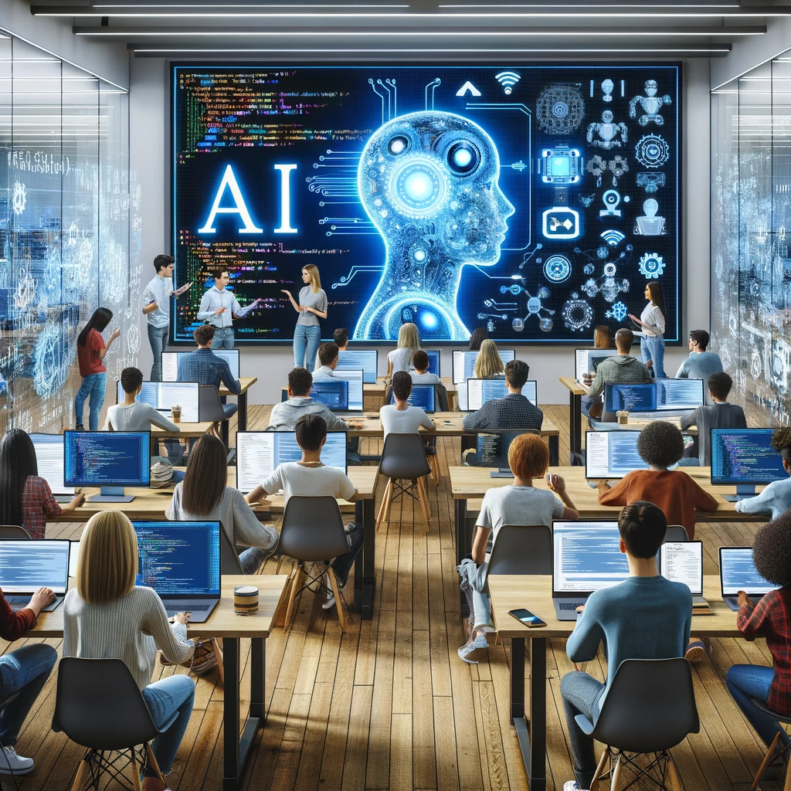

 

## Abuse or Love?

AI is an imperative tool... there are many pros, there are many cons. The pros and cons are individualistic, and that's the crux of the matter, as parents would say, no two kids are alike. That's exactly what AI is—a superstar actor kid who can pay the bills for their parents. Some parents will take advantage of their kid and let them pay all their bills without thinking about the consequences of what they'll do if the benefits of their kid run out. Others? Well, others will aid their children and grow along with them, bettering themselves and their child, and setting their future selves up for success. And yes, we are still talking about AI. How so, you might ask? Well, some people might use AI to completely do their work and assignments without learning anything. By doing so, they are totally ignoring the consequences of what is to come later in life, perhaps as soon as they graduate. They didn't acquire any practical knowledge, thereby hindering their ability to compete in the open job market. And the others? Well, they use AI as a complementary tool to help them with projects. By breaking problems down in a more detailed and simplified manner, it helps them gain a better understanding of the assignment or topic at hand, propelling themselves forward and deepening their knowledge. There is a distinct difference between Abuse and Love.

 

## Fighter or Lover?

Throughout my time as a student in UH Manoa's Software Engineering course (ICS 314), I utilized AI frequently throughout the semester—from in-class WODs to essays, and even the final project. "Was I being Abusive or Loving? I'd like to say I'm more of a Lover rather than a Fighter." I have used AI in this class solely to assist me with debugging code I had already written. Often, I found that AI could overly complicate the code it was asked to write, but it excelled at debugging, identifying errors, explaining what certain blocks of code do, and detailing questions extensively. During the in-class WODs, I was often pressed for time and would overlook simple syntax errors that escaped my notice, but ChatGPT was there to spot these errors in seconds. For the final project, I leveraged AI for some styling elements that were beyond my coding capabilities at the time. However, with the help of ChatGPT, I didn't just copy and paste the code—experience has taught me that this approach often fails. Instead, I reviewed the explanations provided and made sure that the correct variable names and other elements were used for a smooth implementation. As for the essays, well, I'll let you figure that one out; maybe you can spot the hint!

## My Academic Development and Understanding

AI has helped me a lot throughout my short 3-year undergraduate career #GPTAlumni. Primarily, it has been invaluable in helping me break down questions and problems. Often, the assignments presented to me posed quite ambiguous questions, and I'm not really the type to email professors or TAs for clarification. I find satisfaction and the most growth in finding solutions through my own struggles and journey. Many times, this journey has involved using ChatGPT to reword or simplify questions, allowing me to get a stronger grasp of what's being asked of me. Thus, in my academic development, AI has enhanced my understanding of a wide array of concepts, from discrete math and algorithms to software engineering.

## Challenges 

I've found that ChatGPT often either overcomplicates the code you ask it to write or writes very general code. There's usually no in between. Also, it's not the greatest at handling code that has numerous files. Many a time, it's just patience if you are trying to get a fully AI-generated running code right.

## Comparative Analysis

AI to me is what Google and the Internet was oh so many years ago when it came out in the late 1900's, I believe. It's really just a tool to grab information really fast. Since the 1900s, information was read through books, articles, thesauruses, and others. But when the internet came out, information read remained the same; only this time, it's just a quicker look-up for the information. Instead of having to scroll through 10 pages on Google, by the time you ask ChatGPT, it would have gone through the whole internet for you and gotten an answer in seconds. Its just a natural evolution of gathering information.

  
## Future Considerations

The future ties into the concept of "Abusing or Loving" AI. Artificial Intelligence should be taught as a tool in your arsenal, one that is complementary to your education and knowledge, augmenting rather than replacing the hard-earned insights you've gathered through traditional learning. It's essential to perceive AI not just as a shortcut to immediate results but as an enabler that enhances your abilities and deepens your understanding in a myriad of fields. By integrating AI effectively into our learning processes, we can utilize it to expand our horizons, tackle complex problems with greater efficiency, and foster an environment where innovation thrives. This balanced approach can prevent the potential misuse of AI and encourage a healthy, productive relationship with technology.

  
## The Finish Line

It's beyond obvious: AI will further weave itself into society's fabric, and as its presence grows, so too must our readiness to adapt alongside it. There's often a fear that tags along with AI, a nervous anticipation of its capabilities and uses—an understandable, trendy fear, as AI is still pretty fresh on the scene. But then, I guess I should note that AI will only be as intelligent as the computer scientist who programs it. It isn't an all-knowing entity; it's more like a collective of human intelligence that's continually built upon—endlessly, endlessly. It seems to me that as long as we view it simply as a tool, AI holds the potential to usher in a new era of even smarter computer scientists.By allowing the use and transparency of AI for a variety of assignments, this class has helped me navigate my own use of AI, and it's enhanced my software development skills. This class stands out as a prime example of how to blend traditional learning with AI-enhanced approaches. In fact, if you were to ask me, I'd say students are likely to leave this class as more proficient computer scientists.

ChatGPT was used in the making of this essay to enhance the professionalism.
