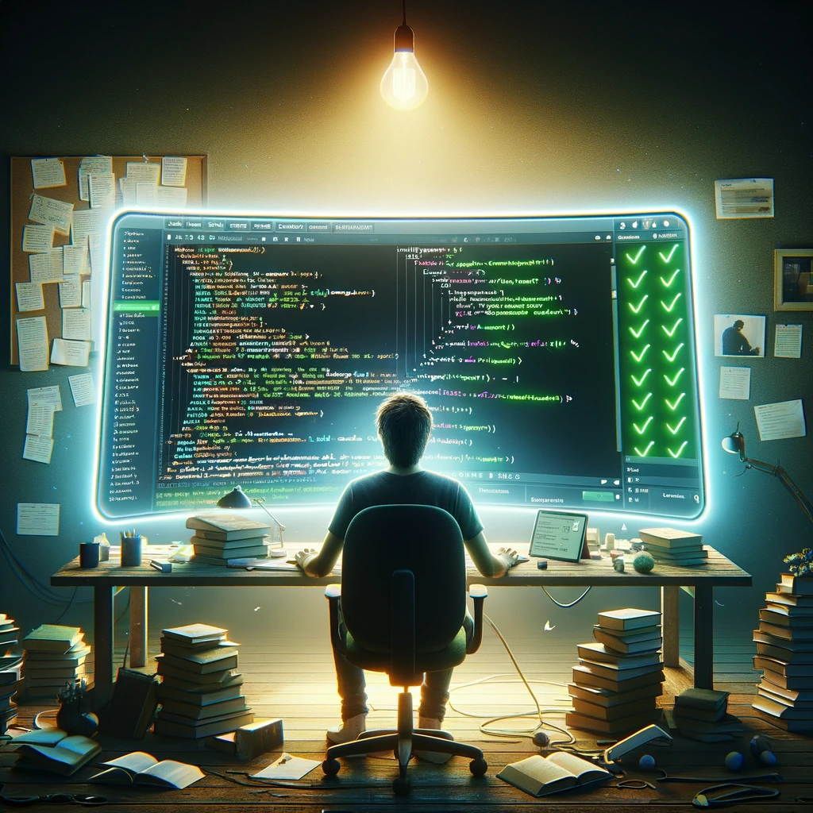

  

## Overview
Coding standards are not just about small things like where to put a curly quote or how to properly indent code. They are a basic part of software engineering that can make a huge difference in the quality of the software we make and the way we create it. Coding standards are not just rules; they have shown me how to write code that is cleaner and easier to manage. They have also been very helpful in helping me learn different programming languages by making the syntax easier to look at.

## The beginning 
During my first week of using ESLint with IntelliJ, I felt like I was facing new challenges and learning new things. I was determined to look for that green checkmark which means I followed all the coding rules. At times it was frustrating and at other times it was easy. Coordinating my code with guidelines gave me a big sense of relief and showed how committed I am to doing good work. Trying to rewrite my code, or change it so that it fits these standards, wasn't easy, though.

## End Of The Road
Standards for writing code have changed how I write my code. They taught me that being good at coding is more than just writing code; it's also about learning, improving, and sharing what you know. These standards are easier to use now thanks to tools like ESLint that are built into IntelliJ IDEA. These tools have also made my work experience better. Although it was tricky and a bit annoying to get used to at first I now see code standards not as limits but as opportunities for growth that push me to become a better developer. Eslint emphasized how disciplined we become as coders when we must follow coding guidelines.  It was tricky at first to get used to IntelliJ and change my code to follow ESLint's instructions, but in the end, the benefits were worth it. Not only does my code now follow the rules, it also has the quality and dependability that I aim for in all of my work.
