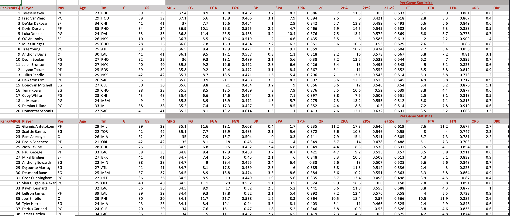
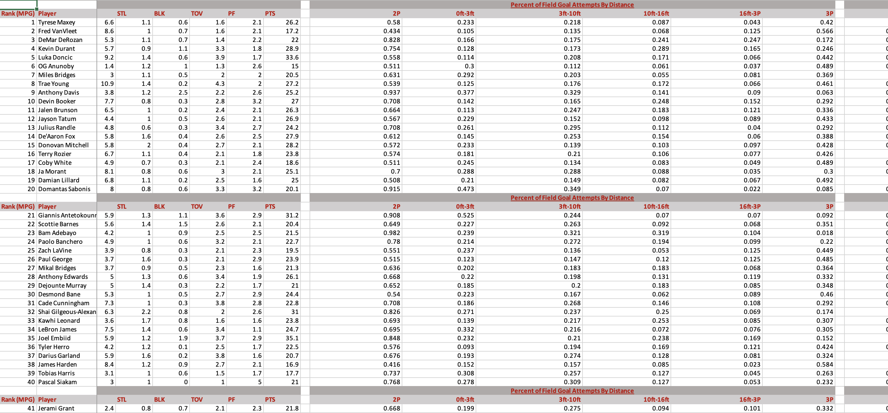
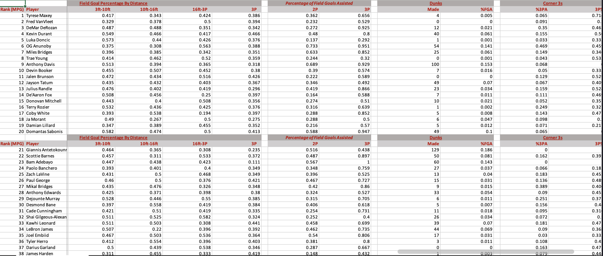

  
  

I made a program that retrieves NBA Per Game and Shooting statistics of all current NBA players. First, it scrapes data from two different sets of different charts – one set is for general stats players put up per game (Points Per Game, Assists Per Game, Rebounds Per Game, etc.), and the other is for advanced specified shooting statistics such as where they're shooting from and how often.
Of course there are hundreds of NBA players some more relevant than others (respectfully), so I have it in my program to filter out any player who plays less than 20 minutes Per Game. In the end, the program merges these two sets of Charts into one, so I have all the important info in a single place. Finally, it saves this combination of data into one Excel file that updates automatically every Sunday. 

Here is some example code to illustrate Simple Schema use:


