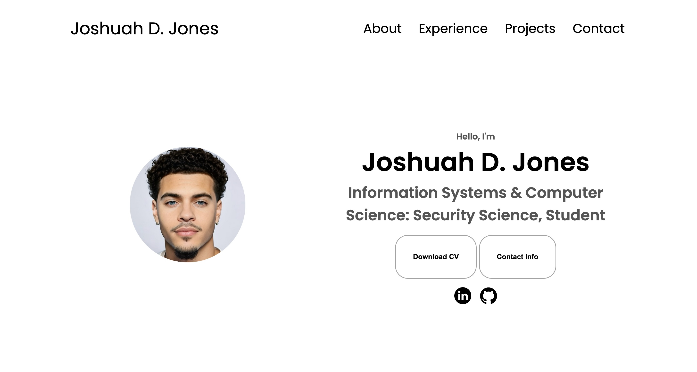

I'm currently building a personal website thats apart from this one based in HTML/CSS to also share my academic journey and work experiences. The website works well on phones, tablets, and computers. It's easy to use and shows off the projects I've done and what I've achieved in school. You can see the programming skills and languages I know and the different kinds of technology I know how to use. 

There's also a section about my work experience, showing how I use what I learn in real situations. The website looks modern and professional, and it's interactive, which makes it fun to explore. You can easily get in touch with me through direct links to my LinkedIn and GitHub profiles, or you can download my resume. 

I'm also currently workin on a special feature using Excel. Whenever someone sends me a message through the website, this tool automatically records who they are and what they said in an Excel document. This way, I can keep track of everyone who contacts me. All in all, this website will be a great place to see what I've done and get in touch with me easily.

Here is some example code to illustrate Simple Schema use:


 
